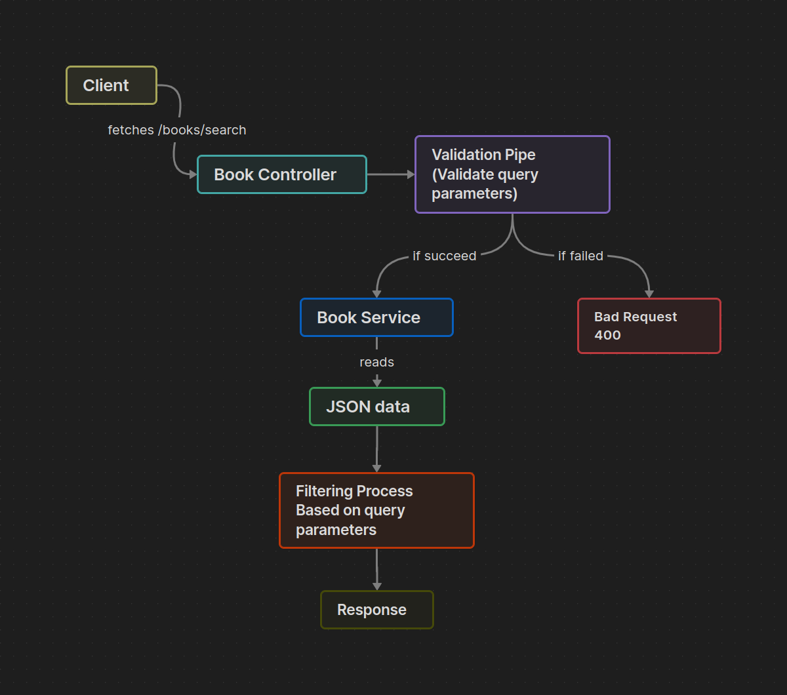

# Book Store

## High Level Architicture



## Installation

```bash
  git clone https://github.com/mohanadft/book-store.git # Clone the Repo
  cd book-store                                         # Go inside the package
  npm install                                           # Install Dependencies
```

## Usage

Ensure that port `3000` is not used by other programs and run the following command:

```bash
  npm run start:dev
```

Now, You can visit `localhost:3000`

## Endpoints

`GET /book/search`

Query Parameters:

- `category` _(optional)_
- `price` _(optional)_ Must be a number
- `date` _(optional)_

Example: `/book/search?price=40&date=2009-04-01` OR `/book/search?category=Java&date=2009`
